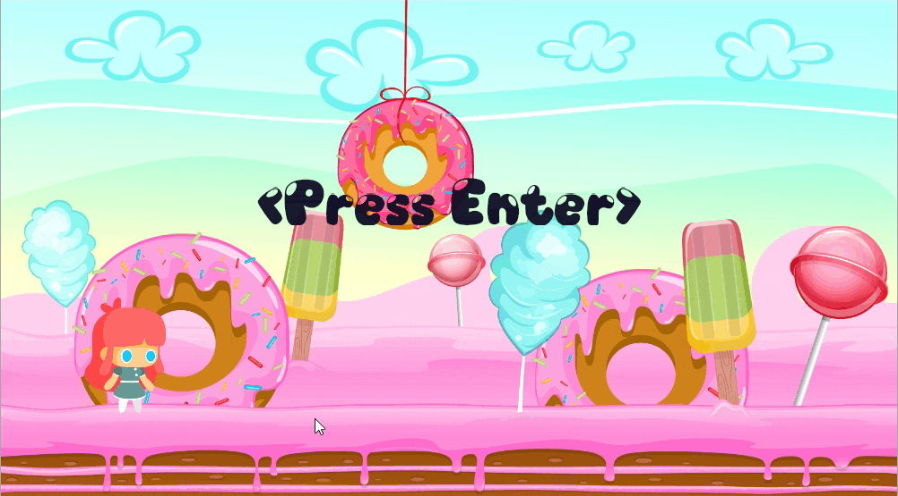

# Cute-runner

A 2d Endless Runner Game made with Bevy Game Engine.

## Table of contents
- **[Project Infos](#project-infos)**
- **[Usage](#usage)**
- **[Screenshots](#screenshots)**
- **[Disclaimer](#disclaimer)**

## Project Infos
* **Date:** September 2021
* **Project idea:** Have fun and play around with the Rust language, as well as the recent Bevy game engine
* **Game objective:** Survive as long as possible to get the highest score by dodging the evil bees :bee:
* **Instructions:** Use the **A**, **D** keys to move the player and **W**/**SPACE** to jump

## Usage
#### 1. Clone the repo and execute:
```
$ cargo run --release
```
It may take a while but you will have the game executable available in the new _**targets**_ folder

## Screenshots
* Full Game View


## Disclaimer
This repository corresponds to a personal project. I do not take any responsibility over any code faults and do not take any credit for the sprites and sounds displayed throughout the game.
